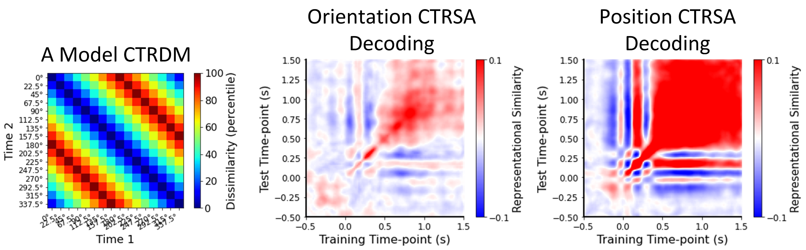

# Summary

Multivariate pattern analysis (MVPA) [@2006Beyond] has become popular in cognitive neuroscience domain. Using MVPA can obtain deeper information from neural activities than traditional univariate analysis. Representational Similarity Analysis (RSA) [@2008Representational] is one of widely used MVPA method by comparing the similarity of neural representations. In RSA, we should firstly calculate the representational dissimilarity matrix (RDM), which reflects the similarity among different task conditions. Then we gain the representational similarity computing the similarity between different RDMs. In traditional RSA, we can only use a hypothesis-based coding model RDM to fit the RDMs from neural activity time by time. By this way, encoding information in our brains in a time course can be successfully decoded. However, we still lack knowing whether representations of certain information from two different times have the same form. So, can we conduct cross-temporal decoding based on RSA?

`PyCTRSA` is a Python Toolkit for novel cross-temporal representational similarity analysis (CTRSA). `PyCTRSA` is free open-source, easy-to-use and comprehensive, which allows psychologists and neuroscientists to perform CTRSA for electroencephalography (EEG) and magnetoencephalography (MEG). CTRSA-based decoding is a new algorithm for cross-temporal E/MEG decoding by RSA. We use the neural data from two different time-points to establish a cross-temporal RDM (CTRDM) corrsponding to time i and time j. By this train of thought, we can obtain Number_of_Times by Number_of_Times CTRDMs. Then we can establish a Coding Model RDM by the experimental hypothesis. Finally, we can calculate the similarity between this Coding Model RDM and the Number_of_Times by Number_of_Times Cross-Temporal RDMs and obtain the cross-temporal decoding results. In `PyCTRSA`, you can not only calculate the cross-temporal similarities based on this novel method to realize decoding, but also calculate the cross-temporal similarities based on neural data under two different conditions to see similar patterns between two conditions and calculate cross-temporal similarities based on traditional RDMs to see similar representational patterns between different time-points.

# Statement of need

`PyCTRSA` is a Python toolkit aiming at providing comprehensive functionality to realize a novel cross-temporal neural decoding method based on CTRSA by using very little codes. It requires several basic Python packages to function, including NumPy [@Van2011The], SciPy [@Virtanen2020Author], Matplotlib [@matplotlib] and NeuroRA [@NeuroRA]. There are four main features in `PyCTRSA`:

- Calculate the cross-temporal representational dissimilarity matrix (CTRDM): a) calculate CTRDMs for a single channel; b) calculate CTRDMs for one subject; c) calculate CTRDMs for multi-channels/subjects.

- Calculate the similarity between two CTRDMs: calculate the similarity by Pearson Correlation/Spearman Correlation/Kendall tau Correlation/Cosine Similarity/Euclidean Distance.

- Calculate the cross-temporal similarity (CTS): a) calculate CTSs between neural data under two conditions; b) calculate CTSs based on traditional RDMs; c) calculate CTSs between CTRDMs and a Coding Model RDM.

- Plot CTRSA Results: a) plot the CTRDM; b) plot the CTS.

In `PyCTRSA`, we provide a demo. By this demo, you will learn and know how to use `PyCTRSA`. The data of this PyCTRSA Demo is based on Bae&Luck's work in 2018 [@2018Dissociable]. All demo data are based on their Experiment 2's data. We can first establish a CTRDM (\autoref{Figure 1} left) based on the encoding hypothesis that the representation between two nearer degrees are more similar, and the representation between two more different degrees are more dissimilar. Then we can calculate the CTRDMs based on ERP data (after 2-6Hz filtering). Finally, CTSs can be obtained by calculating the similarity between the model CTRDM and ERP CTRDMs. \autoref{Figure 1} right shows results of decoding orientation and decoding position based on CTRSA. All processes above are realized by functions in `PyCTRSA`.

Users can find Jupyter Notebook version in `PyCTRSA` website. Additionally, we offer an introduction between classification-based decoding and CTRSA-based decoding.

# Acknowledgements

Members in Memory and Emotion lab at Sun Yet-sen University provided invaluable feedback through the development of `PyCTRSA`.

# References